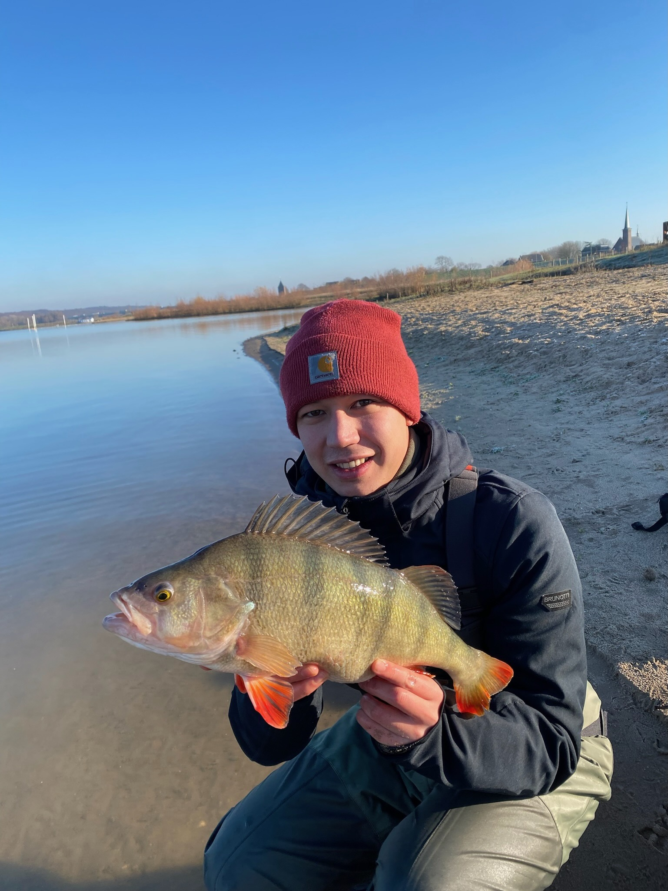

Test project to recreate backgrounds of fishermen. This way they can safely share a picture without fear of revealing where the fish was caught. The model will create a new background based on the one provided.

Happy fishing!

---

## Table of Contents

- [Overview](#overview)
- [Installation](#installation)
- [Usage](#usage)
- [Project Structure](#project-structure)
- [Contributing](#contributing)
- [License](#license)
- [Contact](#contact)

---

## Overview

FishBackground is designed to help fishermen share images safely. By using machine learning, the application removes the original background from a photo and replaces it with a generated one, preserving privacy while still looking natural.

---

## Installation

1. **Clone the repository:**

   ```bash
   git clone https://github.com/MikaSie/FishBackground.git
   cd FishBackground
   ```

2. **Create a virtual environment:**

    ```bash
    python3 -m venv env 
    source env/bin/activate
    ```

3. **Install dependencies:**

    ```bash
    pip install -r requirements.txt
    ```

## Usage

1. **Run the FastAPI application:**

    ```bash
    uvicorn app.main:app --reload
    ```

2. **Access the API:**

- API Docs: <http://127.0.0.1:8000/docs>
- Browse the interactive docs to test endpoints like /process_image.
- Simple Front-End: <http://127.0.0.1:8000/>
- A webpage (served by FastAPI) allows you to upload a foreground image, choose or upload a background, and see the processed image. See example:


3. **Processing images:**

- The API returns the processed image as a PNG.
- You can also download the final result from the webpage.

An example of a picture before and after processing: 




## Project Structure

```text
FishBackground/
│
├── data/                
│   ├── examples          # Examples for GitHub    
│   ├── output            # Placeholder folder for all outputs
│   └── stock_backgrounds # All stock backgrounds for copy+paste segmentations
|
├── models/                
│   ├── __init__.py       
│   └── background.py     # Logic for background segmentation
|
|── static/                 
│   ├── index.html        # HTML for webpage
│   └── styles.css        # CSS style sheet
|
|── tests/                 
│   ├── __init__.py       
│   ├── test_api.py       # Tests for API endpoints
│   └── test_models.py    # Tests for ML models and functions
|
├── utils/                 
│   ├── __init__.py       
│   ├── image_processing.py  # Image pre/post-processing functions
│   └── config.py            # Configuration and environment management
│
├── Dockerfile            # For containerizing the app
├── compose.yaml          # File for setup of Docker
├── LICENSE               # MIT License
├── main.py               # Main file for API access
├── requirements.txt      # Python dependencies
├── README.Docker.MD      # Docker documentation
└── README.md             # Project documentation
```

## Contributing

Contributions are welcome! If you’d like to contribute:

1. Fork the repository.
2. Create a new branch (git checkout -b feature/your-feature).
3. Make your changes and commit them (git commit -am 'Add new feature').
4. Push to the branch (git push origin feature/your-feature).
5. Open a Pull Request.

Please ensure your code adheres to the project’s coding standards and includes tests when appropriate.

## License

This project is licensed under the MIT License. See the LICENSE file for details.

## Contact

If you have any questions or suggestions, please open an issue or contact the maintainer at my GitHub!
